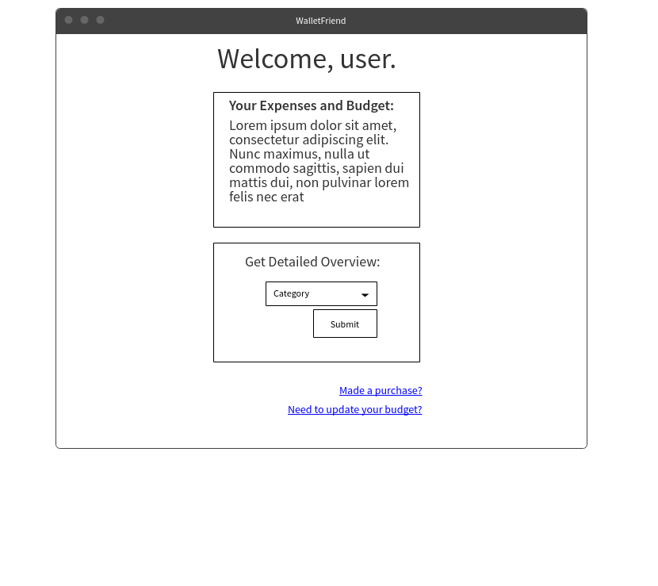
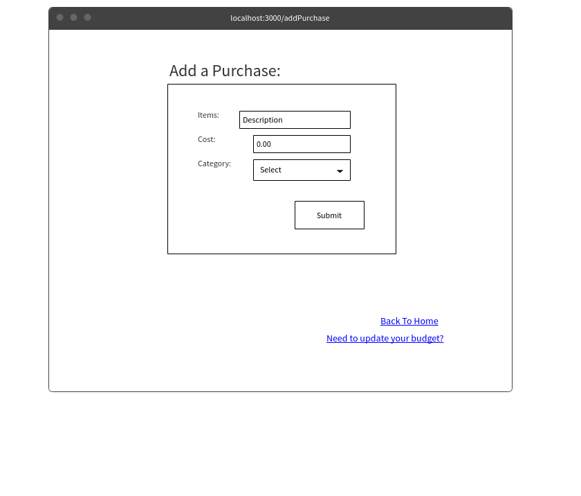
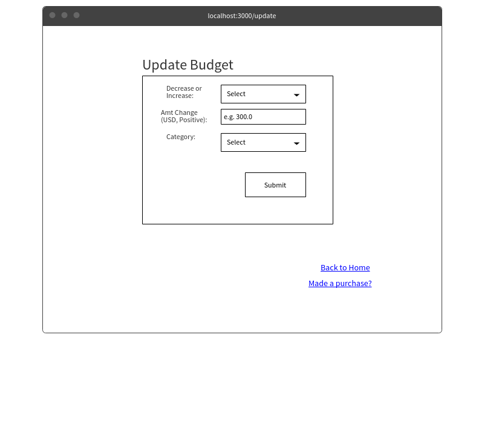

(___TODO__: your project name_)

# WalletFriend

## Overview

Finding out that your bank account balance is lower than you expected is about as fun as a root canal, but keeping track of your expenses can be annoying.

WalletFriend is a web app that will allow users to set budgets for (optional) categories and keep track of their expenses. Users can register and login, at which point they can set (or alter) their spending categories and budgets (e.g. groceries, transportation, etc.) and enter actual purchases they have made. The app will provide them with an overview of their recent spending, as well as a comparison of their overall budget to their actual spending habits. Users will be able to request more detailed comparisons (e.g. per category)


## Data Model

(___TODO__: a description of your application's data and their relationships to each other_) 

The application will store Users, Purchases, and Categories.
* Users can have multiple categories (via refs?? or by embedding?), and multiple purchases(via refs?? or embedding?)
* each category can have...?
* each purchase can have multiple categories (in case one purchase fits into more than one category) via references

(___TODO__: sample documents_)

An Example User:

```javascript
{
  username: "bestcriticever",
  hash: // a password hash,
  categs: // an array of references to category documents
  purchases: //array of purchase documents
}
```

An example Purchase:
```javascript
{
  user: // a reference to a User object
  cost: 20.0 //signifies 20.00 USD
  items: "Shirt from H&M",
  categs: // array of references to category documents
  date: //date of purchase
}
```

An example Category:
```javascript
{
  user: // a reference to a User object
  budget: 200.0 //signifies 200.00 USD,
  name: "Groceries"
}
```


## [Link to Commented First Draft Schema](db.js) 

## Wireframes

/ - Homepage: users can see overviews of their spending



/addPurchase - : users can add purchase information



/update - Homepage: users can update budget information




## Site map

(___TODO__: draw out a site map that shows how pages are related to each other_)

Here's a [complex example from wikipedia](https://upload.wikimedia.org/wikipedia/commons/2/20/Sitemap_google.jpg), but you can create one without the screenshots, drop shadows, etc. ... just names of pages and where they flow to.

## User Stories or Use Cases

(___TODO__: write out how your application will be used through [user stories](http://en.wikipedia.org/wiki/User_story#Format) and / or [use cases](https://www.mongodb.com/download-center?jmp=docs&_ga=1.47552679.1838903181.1489282706#previous)_)

1. as non-registered user, I can register a new account with the site
2. as a user, I can log in to the site
3. as a user, I can create a new grocery list
4. as a user, I can view all of the grocery lists I've created in a single list
5. as a user, I can add items to an existing grocery list
6. as a user, I can cross off items in an existing grocery list

## Research Topics

I'm planning on researching and using the following for my project:

* (5 points) Integrate user authentication
* (2 points) Use a CSS framework
* (2 points) Use a CSS preprocessor

9 points total out of 8 required points


## [Link to Initial Main Project File](app.js) 

(___TODO__: create a skeleton Express application with a package.json, app.js, views folder, etc. ... and link to your initial app.js_)

## Annotations / References Used

(___TODO__: list any tutorials/references/etc. that you've based your code off of_)

1. [passport.js authentication docs](http://passportjs.org/docs) - (add link to source code that was based on this)
2. [tutorial on vue.js](https://vuejs.org/v2/guide/) - (add link to source code that was based on this)
