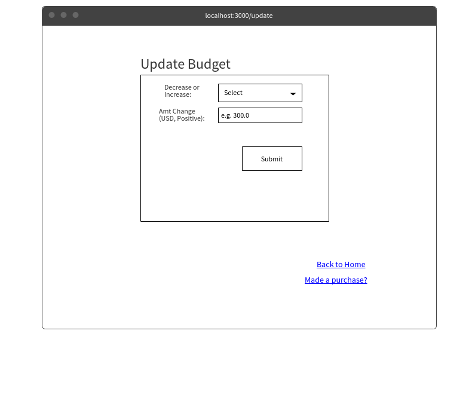

# WalletFriend

## Overview

Finding out that your bank account balance is lower than you expected is about as fun as a root canal, but keeping track of your expenses can be annoying.

WalletFriend is a web app that will allow users to set a budget and keep track of their expenses. Users can register and login, at which point they can set (or alter) their budget on the homepage (or during registration itself). They may also add purchases they have made through the homepage. The app will provide them with an overview of their spending, as well as a comparison of their overall budget to their actual spending habits. Users will be able to request detailed information about their purchases/spending.


## Data Model


The application will store Users and Purchases.
* Users can multiple purchases
* Each purchase can have one associated user


An Example User:

```javascript
{
  username: "iShouldStopBuyingThings",
  hash: // a password hash,
  purchases: //array of references to purchase documents
}
```

An example Purchase:
```javascript
{
  user: // a reference to a User document
  cost: 20.0 //signifies 20.00 USD
  items: "Completely unnecessary stuff",
  date: //date of purchase (optional)
}
```


## [Link to Commented First Draft Schema](db.js) 

## Wireframes

/ - Homepage: users can see overviews of their spending


/addPurchase - : users can add purchase information


/update - Homepage: users can update budget information




## [Site map](documentation/sitemap.png)


## User Stories or Use Cases

1. as non-registered user, I can register a new account with the site
2. as a user, I can log in to the site
3. as a user, I can create and update budget information
4. as a user, I can view all of the purchases/transactions I have added to the app (by viewing "detailed" sections for all or specific purchases)
5. as a user, I can add and remove information about purchases/transactions I have made
6. as a user, I can see a general overview of my spending information compared to the budget I have set on the app

## Research Topics

I'm researching/using the following for my project:

* (5 points) Integrate user authentication
* (2 points) Use a CSS framework
* (3 points) Client-side form validation using JavaScript (in file main.js in public/javascripts)

10 points total out of 8 required points<br> 


## [Link to Initial Main Project File](app.js) 

## Annotations / References Used

1. [Passport.js authentication docs](http://passportjs.org/docs/)
2. Lecture slides on Passport
* Based generally on 1 and mostly/specifically 2: [db.js lines 4 and 17](db.js), [auth.js](auth.js), [app.js lines 3-12, 26-35, 248-293](app.js)

3. [Bootstrap docs](http://getbootstrap.com/getting-started/#download)
4. [w3schools Bootstrap guide](https://www.w3schools.com/bootstrap/default.asp)
* Based generally on 3 and (mostly/specifically) 4: [addPur.hbs line 3](views/addPur.hbs), [details.hbs line 4](views/details.hbs), [layout.hbs line 7, 11-28](views/layout.hbs), [index.hbs lines 9-21](views/index.hbs)

5. [Decimals/currency in forms](https://jsfiddle.net/trixta/UC6tG/) 
* Based on 5: [register.hbs line 8](views/register.hbs), [addPur.hbs line 8](views/addPur.hbs)

6. [Using onsubmit for form validation](https://www.w3schools.com/jsref/event_onsubmit.asp)
* Based on 6: [remP.hbs line 9](views/remP.hbs)